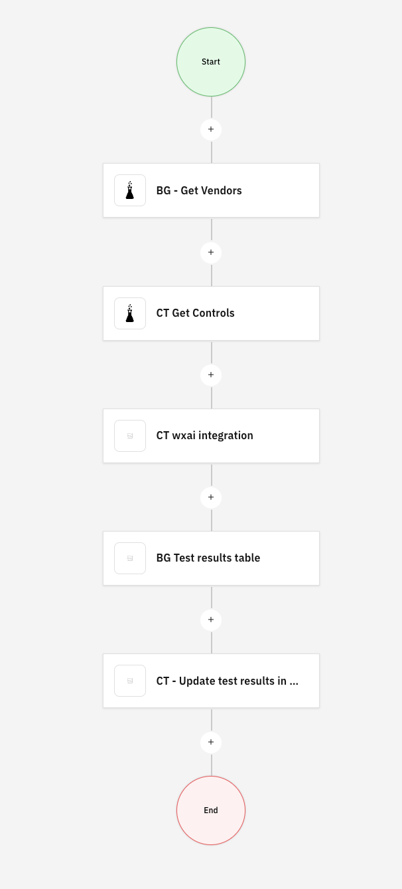
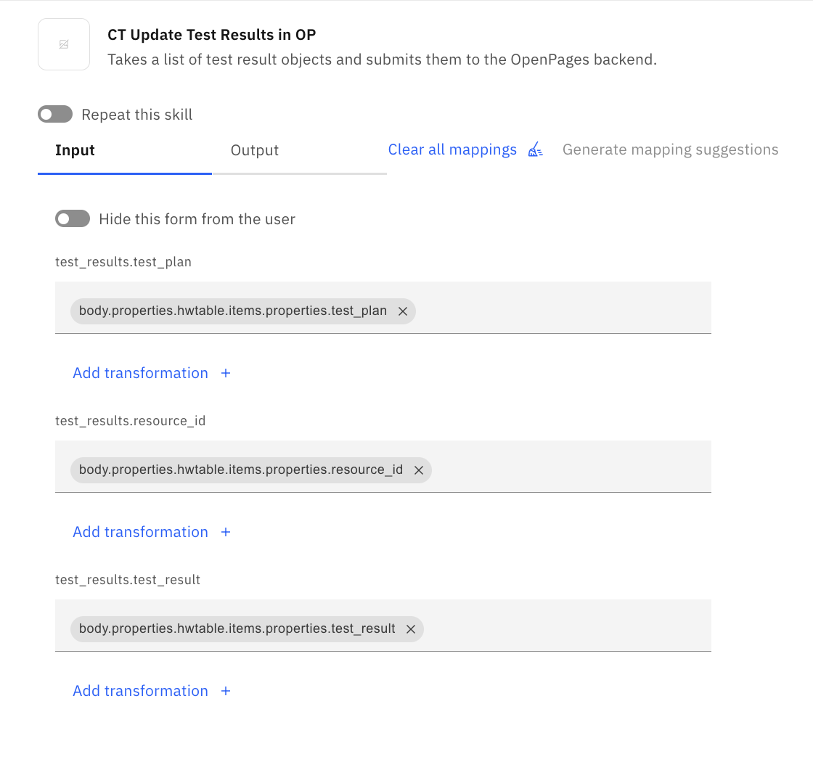

# Work in progress

This Readme file guides you through setting up of watsonx Orchestrate skills and related IBM Cloud Code Engine applications and functions

## Clone the repo to local
Clone this GitHub repo to your local

## Skills
The necessary OpenAPI specification file and also Code Engine code are available in the Orchestrate/Skills folder

## Get IBM Cloud API Key

We will need IBM Cloud API Key to authenticate to OpenPages and watsonx.ai. 

Refer to the [Managing user API keys](https://cloud.ibm.com/docs/account?topic=account-userapikey&interface=ui) for detailed instruction to retrieve your IBM Cloud API Key.

## Steps to deploy CE applications and functions

You will find both Code Engine Applications as well as IBM Cloud function code. 

Refer to [Deploying applications on Code Engine](https://cloud.ibm.com/docs/codeengine?topic=codeengine-deploy-app-tutorial) and [Working with Cloud functions](https://cloud.ibm.com/docs/codeengine?topic=codeengine-fun-work) if you need help to deploy following. Keep in mind that 
- You need to set API_KEY environment variable for all the functions and applications
- You need to update API endpoints for OpenPages and watsonx.ai

Applications/Functions
- Orchestrate/Skills/Get Vendors/Functions/get-vendors-list.py
- Orchestrate/Skills/Get Controls/Functions/get-controls-for-vendor.py
- Orchestrate/Skills/wxai integration - async/CE Code
- Orchestrate/Skills/wxai to table/CE Code
- Orchestrate/Skills/Update OpenPages/CE Code

Verify that these application are running fine by calling their API endpoints. Make a note of the endpoints. These will be required to be used in OpenAPI specification files.

## Steps to deploy skills in wxO

You will need to create skills using each of the OpenAPI files listed below. If needed, refer to instructions provided in [Building skills by importing OpenAPI files](https://www.ibm.com/docs/en/watsonx/watson-orchestrate/current?topic=flows-building-skills-by-importing-openapi-files) 

- Orchestrate/Skills/Get Vendors/OpenAPI/vendorlist-OpenAPI.json
- Orchestrate/Skills/Get Controls/OpenAPI/get-controls-list.json
- Orchestrate/Skills/wxai integration - async/OpenAPI/async-wx-ai.json
- Orchestrate/Skills/wxai to table/OpenAPI/wxai-to-table.json
- Orchestrate/Skills/Update OpenPages/OpenAPI/update-test-results-to-OP.json

For each of the skills you need to add connections to the SkillSets `Personal skills` and `Orchestrate Agent skillset` and also to `AI agent configuration` -> `Apps and skills`

## Create skill flow

Create skill flow as shown in the below image

Map inputs from previous skill outputs as appropriate. Many of them are straight forward. One or two might need some help. Attaching screenshot, where helps is needed, below.

and 

Add the skill flow in wxO `AI agent configuration` -> `Apps and skills`. Provide a description that will help trigger the user utterances. e.g. `I want to test controls`.

## Run the application end-to-end

In wxO `AI Agent` chat, type you intent. e.g. `I want to test controls` and hit enter. Follow the prompts and select necessary inputs.

## Troubleshooting

1. If any skill is failing to be called then
1.1 Ensure that endpoints of OpenPages and watsonx.ai are up and running
1.2 Check Code Engine application logs for that skill and ensure that it is being called and it returns appropriate data

